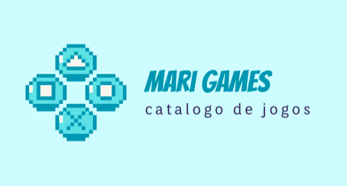
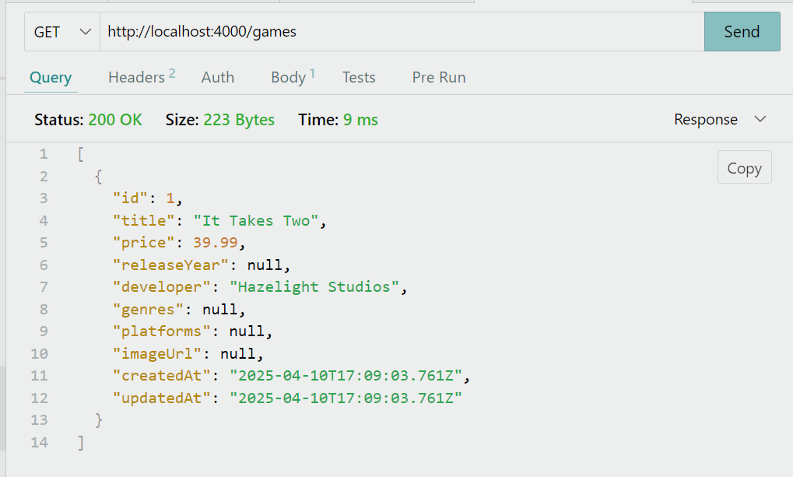
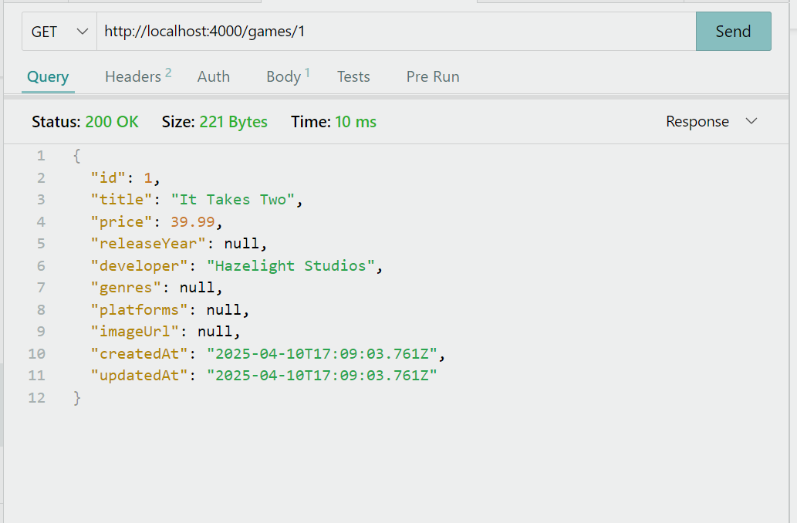
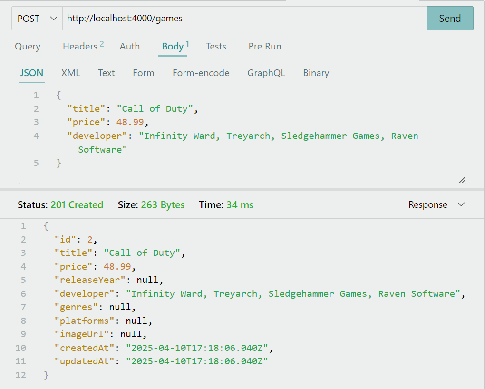
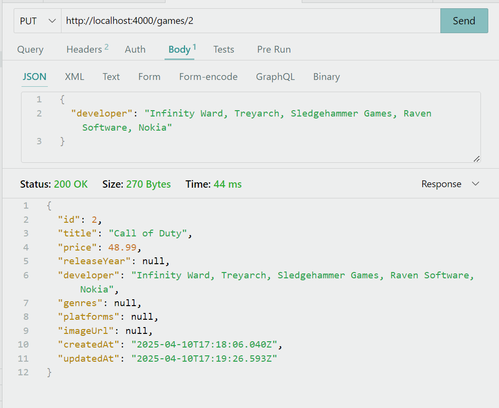
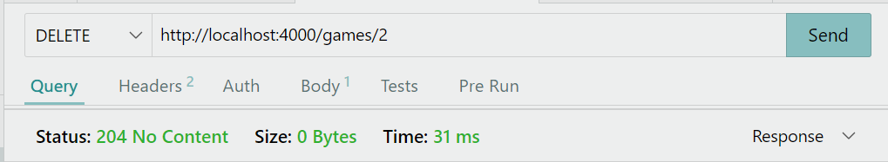

# 🎮 Mari Games API


## 📝 Introdução
**Desafio Proposto:** A loja "MariGames"está precisando de um sistema de backend para gerenciar seu inventário, permitindo operações de criação, leitura, atualização e remoção (CRUD) de produtos. A empresa optou por uma arquitetura moderna utilizando Node.js, Express e Prisma ORM para garantir a integridade e persistência dos dados.


## ⚒ Tecnologias Utilizadas


 |  |   |  | 

## 📅 API Endpoints
| Método HTTP | Endpoint         | Descrição                         |
|-------------|------------------|-----------------------------------|
| GET         | /games           | Retorna todos os Jogos            |
| GET         | /games/{id}      | Retorna um jogo específico        |
| POST        | /games           | Cria um novo jogo                 |
| PUT         | /games/{id}      | Atualiza um jogo existente        |
| DELETE      | /games/{id}      | Remove uma jogo específico        |

## Exemplos de requisições e respostas para cada endpoint

#### Buscar todos os Jogos - GET /games
```http://localhost:4000/games```

```json
[
  {
    "id": 1,
    "title": "It Takes Two",
    "price": 39.99,
    "releaseYear": null,
    "developer": "Hazelight Studios",
    "genres": null,
    "platforms": null,
    "imageUrl": null,
    "createdAt": "2025-04-10T17:09:03.761Z",
    "updatedAt": "2025-04-10T17:09:03.761Z"
  }
]
```


#### Buscar jogo específico - GET /games/{id}

```http://localhost:4000/games/1```

```json
{
  {
    "id": 1,
    "title": "It Takes Two",
    "price": 39.99,
    "releaseYear": null,
    "developer": "Hazelight Studios",
    "genres": null,
    "platforms": null,
    "imageUrl": null,
    "createdAt": "2025-04-10T17:09:03.761Z",
    "updatedAt": "2025-04-10T17:09:03.761Z"
  }
}
```


#### Criar um novo Jogo - POST /games
```http://localhost:4000/games```

```json
{
    "title": "Novo Jogo",
    "price": 00.00,
    "developer": "Desenvolvedor"
}
```


#### Atualizar um jogo existente - PUT /games/{id}
```http://localhost:4000/games/4```

```json
{
    "developer": "Desenvolvedor Atualizado",
}
```


#### Deletar um jogo do catálogo DELETE /games/{id}
```http://localhost:4000/games/2```




## 📊 Como Executar
1. Instale as dependências do projeto:

```bash
npm install
```

2. Crie o arquivo `.env` com a variável `DATABASE_URL` apontando para o banco de dados desejado.

```
DATABASE_URL="file:./dev.db"
```

3. Execute as migrações:

```bash
npx prisma migrate dev
```

4. Inicie o servidor:

```bash
npm run dev
```

## 📚Licença
Este projeto está licenciado sob a Licença MIT - consulte o arquivo [LICENSE](./LICENSE) para obter detalhes.